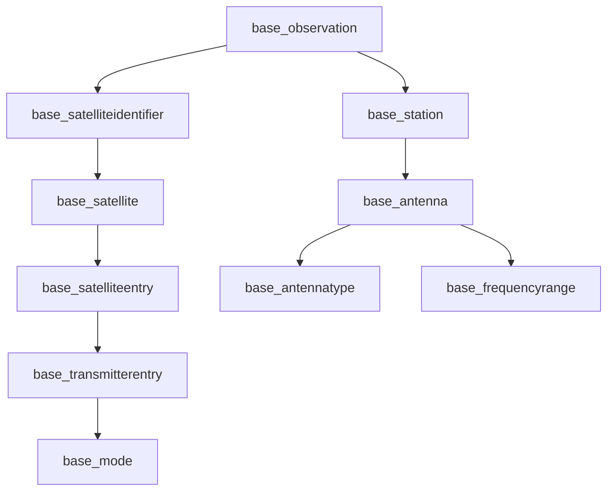

# 📡 SatNOGS Dataset for Satellite Pass Prediction

## Project: Satellite Pass Prediction & Observation Success Rate
**MIT Emerging Talent Program in Computer and Data Science**  
*Capstone Project*

---

## 📊 [Dataset](https://drive.google.com/drive/folders/1A30kx6fK31QP-aTVHl6mFSN3VMp53BHt?usp=sharing) Overview

### Source
- **Primary Source**: [SatNOGS (Satellite Networked Open Ground Station) database](https://drive.google.com/drive/folders/1A30kx6fK31QP-aTVHl6mFSN3VMp53BHt?usp=sharing)
- **Database**: MariaDB/MySQL (`satnogs` database)
- **API Backup**: https://network.satnogs.org/api/
- **Data Collection Period**: October 12, 2015 - November 12, 2025

### Size & Scope
- **Total Observations**: 12,546,241 satellite passes
- **Time Range**: 10 years of continuous data
- **Ground Stations**: 3,912 unique stations worldwide
- **Satellites**: 9,759 unique satellite entries
- **Transmitters**: 9,869 transmitter configurations

### Key Tables
| Table | Rows | Description |
|-------|------|-------------|
| `base_observation` | 12.5M | Core observation records with success/failure indicators |
| `base_station` | 3,912 | Ground station metadata (location, altitude, equipment) |
| `base_satelliteentry` | 9,759 | Satellite characteristics and metadata |
| `base_transmitterentry` | 9,869 | Transmitter configurations and frequencies |
| `base_antenna` | 4,437 | Station antenna configurations |
| `base_satelliteidentifier` | 2,920 | Unique satellite identifiers |

---

## 📁 Directory Structure

- `1_datasets/`
  - `raw/` — Raw data samples (CSV format)
    - `base_observation_sample_100k.csv` — Balanced sample by status
    - `base_observation_latest_50k.csv` — 2025 observations
    - `base_station_sample.csv` — All ground stations
    - `base_satelliteentry_sample.csv` — Satellite metadata
    - `base_transmitterentry_sample.csv` — Transmitter configs
    - `base_antennatype_full.csv` — Complete antenna types
    - … (additional sampled tables)
  - `metadata/` — Dataset documentation
    - `dataset_timeline.csv` — Time range and volume statistics
    - `table_statistics.csv` — Row counts for all tables
    - `data_dictionary.csv` — Column descriptions and sample values
    - `schema_summary.md` — Detailed schema exploration
  - `export_raw_samples.ipynb` — Data export notebook
  - `README.md` — This file
---

## 🎯 Target Variable Definition

### Observation Status Codes (Hypothesis)
Based on initial analysis of 12.5M observations:

| Status Code | Count | Percentage | Proposed Label |
|-------------|-------|------------|----------------|
| `100` | 4,613,718 | 36.77% | **In Progress** (needs waterfall verification) |
| `-100` | 2,624,418 | 20.92% | **Failed Observation** |
| `0` | 2,536,168 | 20.21% | **Successful Observation** (primary success indicator) |
| `-1000` | 946,432 | 7.54% | **Severely Failed Observation** |

### Success Criteria (Proposed)
- **Success**: `status = 0` (2.5M observations, 20.21% of dataset)
- **Failure**: `status = -100` or `status = -1000` (3.6M observations, 28.46% of dataset)
- **Ambiguous**: `status = 100` (4.6M observations, requires waterfall_status analysis)

---

## 🔑 Key Features for ML Model

### 1. **Pass Parameters** (from `base_observation`)
- `max_altitude`: Maximum satellite elevation (degrees)
- `rise_azimuth`: Azimuth angle at satellite rise
- `set_azimuth`: Azimuth angle at satellite set
- `duration_seconds`: Observation duration (end - start)
- `start`, `end`: Timestamps for temporal features

### 2. **Station Characteristics** (from `base_station`)
- `lat`, `lng`: Station coordinates
- `alt`: Station altitude (meters)
- `horizon`: Minimum elevation horizon (degrees)
- `qthlocator`: Grid square location

### 3. **Satellite Metadata** (from `base_satelliteentry`)
- `norad_cat_id`: NORAD catalog ID
- `name`: Satellite name
- `status`: Operational status
- `countries`: Country of origin

### 4. **Transmitter Information** (from `base_transmitterentry`)
- Frequency ranges (uplink/downlink)
- Modulation modes
- Baud rates

### 5. **Derived Features** (to be engineered)
- Time of day (hour bins)
- Day of week
- Season
- Elevation bins
- Pass duration categories

---

## ⚠️ Data Quality Notes

### Missing Data
| Column | NULL Percentage | Impact | Mitigation |
|--------|----------------|---------|------------|
| `station_lat`, `station_lng` | 100% | High | Join with `base_station` table |
| `center_frequency` | 100% | High | Join with transmitter data |
| `max_altitude` | 12.43% | Medium | Filter or impute |
| `rise_azimuth`, `set_azimuth` | 12.43% | Medium | Filter or impute |

### Sampling Strategy
Due to memory constraints (12.5M rows → 100K sample):
- **Balanced by status**: Proportional sampling of success/failure cases
- **Time-based**: Latest observations (2025) preserved separately
- **Full exports**: Small tables exported completely
- **Strategic joins**: Relationship tables sampled proportionally

---

## 🚀 Usage Instructions

### 1. **Load Sample Data** (Python)
```python
import pandas as pd

# Load observation sample
obs_df = pd.read_csv("1_datasets/raw/base_observation_sample_100k.csv")

# Load station data
stations_df = pd.read_csv("1_datasets/raw/base_station_sample.csv")

# Load metadata
timeline = pd.read_csv("1_datasets/metadata/dataset_timeline.csv")
```
### 2. Join Observations with Stations
```python
# Merge observation with station data
df = obs_df.merge(
    stations_df[['id', 'lat', 'lng', 'alt', 'horizon']],
    left_on='ground_station_id',
    right_on='id',
    how='left',
    suffixes=('_obs', '_stat')
)
```
### 3. Create Target Variable
```python
# Binary classification: success vs failure
df['is_success'] = df['status'].apply(
    lambda x: 1 if x == 0 else 0 if x in [-100, -1000] else None
)

# Multi-class for exploration
status_mapping = {
    0: 'success',
    -100: 'failure',
    -1000: 'severe_failure',
    100: 'in_progress'
}
df['status_label'] = df['status'].map(status_mapping)
```
### 4. Calculate Derived Features
```python
# Convert timestamps
df['start'] = pd.to_datetime(df['start'])
df['end'] = pd.to_datetime(df['end'])

# Duration in seconds
df['duration_seconds'] = (df['end'] - df['start']).dt.total_seconds()

# Time features
df['hour_of_day'] = df['start'].dt.hour
df['day_of_week'] = df['start'].dt.dayofweek
df['month'] = df['start'].dt.month
```
### 🔗 Table Relationships



### Primary Joins:

`observation.ground_station_id` → `station.id`

`observation.sat_id` → `satelliteidentifier.sat_id`

`satelliteidentifier.id` → `satellite.satellite_identifier_id`

`satellite.satellite_entry_id` → `satelliteentry.id`

### 📈 Dataset Statistics
Temporal Distribution
First Observation: October 12, 2015 15:13:16

Last Observation: November 12, 2025 09:59:41

Total Duration: 10 years, 1 month

Average Daily Observations: ~3,440 observations/day

Geographic Coverage
Stations: 3,912 worldwide

Countries: Distributed globally (QTH locators in metadata)

Altitude Range: Station elevations from 0 to 3,300+ meters

### Success Rate Analysis
Overall Success Rate: ~20.21% (status = 0)

Failure Rate: ~28.46% (status = -100 or -1000)

Ambiguous Rate: ~36.77% (status = 100, needs verification)

### 🎯 For Machine Learning
Feature Groups

| Group       | Features                         | Impact on Success Prediction           |
|-------------|----------------------------------|----------------------------------------|
| Temporal    | `hour_of_day`, `day_of_week`, `month` | Likely high (solar interference, station schedules) |
| Geometric   | `max_altitude`, `duration`, `azimuth angles` | Critical (pass geometry)               |
| Station     | `altitude`, `horizon`, `location` | Medium (equipment capabilities)        |
| Satellite   | `type`, `country`, `operational status` | Low-Medium (signal characteristics)    |

Data Splits Recommended
Training: 2015-2022 (70%)

Validation: 2023-2024 (15%)

Testing: 2025 (15%)

### 📚 References & Resources
SatNOGS Resources
API Documentation: https://network.satnogs.org/api/

Database API: https://db.satnogs.org/api/

Project Website: https://satnogs.org/

GitHub: https://github.com/satnogs

## Related research

- SatNOGS — A global, volunteer-driven network of satellite ground stations that provides the observational data used in this project. (https://network.satnogs.org/)
- Amateur satellite communication protocols — Common protocols and framing used by community ground stations for receiving and decoding satellite telemetry.
- Pass prediction & orbit propagation — Algorithms and libraries for predicting satellite passes from TLEs (e.g., SGP4 / TLE propagation) used to compute pass geometry and timing.

## Contributing & citation

### How to contribute
- Found an issue or want to improve the dataset or code? Open an issue or submit a pull request on this repository. Include a clear description, reproducible steps, and tests or examples where applicable.
- For dataset changes, document the sampling or processing rationale and note any downstream effects on analyses or models.

### How to cite the dataset
SatNOGS Network. You can have access to the dataset I used for this project (2015–2025) [here](https://drive.google.com/drive/folders/1A30kx6fK31QP-aTVHl6mFSN3VMp53BHt?usp=sharing), which is the Satellite Observation Database. Retrieved from https://network.satnogs.org/

### How to cite this project
Shadi Shadabshoar. ELO2-SatNOGs-repo-main. GitHub. https://github.com/ShadiShadab/ELO2-SatNOGs-repo-main

## Project team
- Student: [Shadi Shadabshoar](https://www.linkedin.com/in/shadi-shadabshoar/)  
- Program: MIT Emerging Talent Program in Computer and Data Science  
- Institution: Massachusetts Institute of Technology

## License
- SatNOGS data: Open Data Commons Attribution License (ODC-By).  
- Project code: MIT License — see the repository LICENSE file for full terms.

